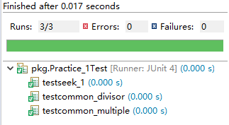
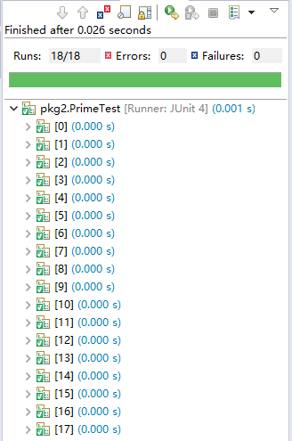
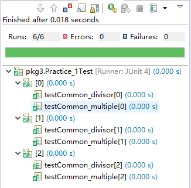
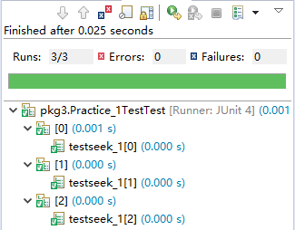
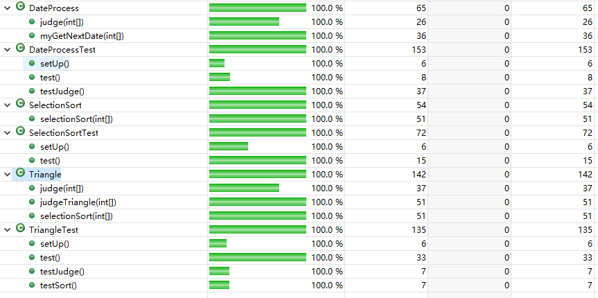
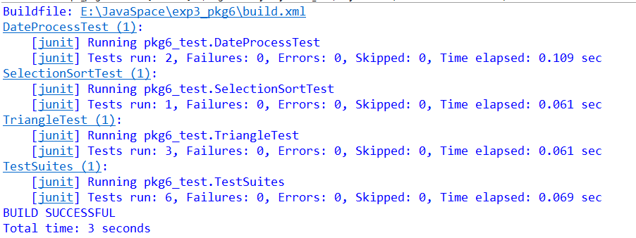

# 实验二 Junit+eclemma+ant自动化测试

| 班级           | 学号       | 姓名   | 指导老师 |
| -------------- | ---------- | ------ | -------- |
| 软件工程1603班 | 2016012963 | 董佩杰 | 毛锐     |

## 一、实验目的

1) 掌握Junit的安装及其与Eclipse的集成。

2) 利用Junit进行单元测试。

3) 掌握Junit中常用annotation： @Before、@After、@Test、@Ignore、@BeforeClass、@AfterClass的用法，了解@Test的两个参数timeout和expected的用法。

4) 掌握Junit中套件测试和参数化测试的方法。

5) 掌握Eclemma的安装和使用。

6) 基于Eclemma的覆盖率测试对Junit单元测试覆盖分析，提升测试质量。

7) 利用Ant进行自动化测试的配置和执行

## 二、实验步骤

### 1. Junit的安装及其与Eclipse的集成。

(两种方法，(1)-(3)本地安装，(4)Eclipse集成安装)

(1)从[Download Junit](http://www.Junit.org)下载Junit压缩包，把Junit压缩包解压到一个物理路径

(2)记录Junit4.10.jar文件所在目录。

(3)设置环境变量CLASS_PATH。

(4)在Eclipse菜单“project”的子项“properties”中选择“Java Build Path”，单击“Libraries”标签，添加JAR，即选择junit.jar或junit-4.10.jar，单击打开，就完成了Junit的安装。

### 2. Junit单元测试

#### 1. 实习题一

利用Junit Test Case生成测试用例的框架，在框架中设计测试代码，完成对下面类Practice_1中common_divisor，common_multiple，seek_1方法的测试。

```java
package pkg;


/**
 * @author pprp
 * @category 求解最大公约数和最小公倍数以及查找功能
 */
public class Practice_1 {
	public int common_divisor(int a, int b) { // 求最大公约数
		int c, r;
		if (a < b) {
			c = a;
			a = b;
			b = c;
		}
		r = 1;
		while (r != 0) {
			r = a % b;
			a = b;
			b = r;
		}
		return a;
	}

	public int common_multiple(int a, int b) { // 最小公倍数
		return a * b / common_divisor(a, b);
	}

	public boolean seek_1(int[] a, int x) { // 查找
		boolean flag = false;
		for (int i = 0; i < a.length; i++) {
			if (x == a[i])
				flag = true;
		}
		return flag;
	}

	public static void main(String arg[]) { // 主函数
		int b[] = { 10, 20, 15, 30, 25, 40, 35, 50 };
		int x, y, k;
		x = 12;
		y = 6;
		k = 40;
		Practice_1 a = new Practice_1();
		System.out.println("最大公约数为：" + a.common_divisor(x, y));
		System.out.println("最小公倍数为：" + a.common_multiple(x, y));
		System.out.println("查找结果为：" + a.seek_1(b, k));
	}
}
```

测试类：

```java
package pkg;

import static org.junit.Assert.*;

import org.junit.AfterClass;
import org.junit.BeforeClass;
import org.junit.Test;

/**
 * @author pprp
 * @category 对Practice_1进行测试
 */
public class Practice_1Test {
	private static Practice_1 test1 = null;
	private static int num1;
	private static int num2;
	private static int arr[] = {1,4,3,2,5,4,55,3,22,44,77,100,22,43,21,55,24,126,4,3,4,2,4,23,4,234,23,42342,3423,2,544,46,4,75,6};
	private static int find;
	@BeforeClass
	public static void setUpBeforeClass() throws Exception {
		test1 = new Practice_1();
		num1 = 12;
		num2 = 6;
		find = 55;
	}

	@AfterClass
	public static void tearDownAfterClass() throws Exception {
		
	}
	@Test
	public void testcommon_multiple() {
		assertEquals(12,test1.common_multiple(num1, num2));
	}
	
	@Test
	public void testcommon_divisor() {
		assertEquals(6,test1.common_divisor(num1,num2));
	}
	
	@Test
	public void testseek_1() {
		assertTrue(test1.seek_1(arr, find));
	}
}
```

测试结果：



#### 2. 实习题二

设计判断一个数是不是素数的程序，用基本断言类型实现测试，并用setup()初始化测试环境。参数化测试数据，并用Suite方法调用所有单个测试类。

**判断素数类：**

```java
package pkg2;

/**
 * @author pprp
 * @category 判断一个证书是否为素数
 */
public class Prime {

	public boolean isPrime(int num) {
		for (int i = 2; i < num; i++) {
			if (num % i == 0) {
				return false;
			}
		}
		return true;
	}

	public static void main(String[] args) {
		Prime a = new Prime();
		System.out.println(a.isPrime(9));
	}
}
```

**测试类：**

```java
package pkg2;

import static org.junit.Assert.*;

import java.util.Arrays;
import java.util.Collection;

import org.junit.After;
import org.junit.Before;
import org.junit.Test;
import org.junit.runner.RunWith;
import org.junit.runners.Parameterized;
import org.junit.runners.Parameterized.Parameters;

/**
 * @author pprp
 * @category 参数化测试，测试素数
 */
@RunWith(Parameterized.class)
public class PrimeTest {

	private Prime test2;
	private int input;
	private boolean output;

	@Before
	public void setUp() throws Exception {
		test2 = new Prime();
	}

	@After
	public void tearDown() throws Exception {

	}

	@Parameters
	public static Collection<Object[]> data() {
		Object[][] object = { { 3, true }, { 7, true },{ 4, false },
		 { 5, true },{ 8, false },{6, false },
		 { 9, false },{ 10, false },{ 11, true },
		 { 12, false },{ 13, true },{ 14, false },
		 { 42, false },{ 41, true },{ 631, true },
		 { 247, false },{ 996, false },{ 96, false }};
		return Arrays.asList(object);
	}

	public PrimeTest(int intput, boolean output) {
		this.input = intput;
		this.output = output;
	}

	@Test
	public void testisPrime() {
		assertEquals(output, test2.isPrime(input));
	}

}
```

测试结果：



使用Suite对以上两个测试类进行测试：

```java
package pkg2;

import org.junit.runner.RunWith;
import org.junit.runners.Suite;
import org.junit.runners.Suite.SuiteClasses;

/**
 * @author pprp
 * @category 使用Suite进行批量测试，此处测试Practice_1和Prime的测试类
 */
@RunWith(Suite.class)
@SuiteClasses({PrimeTest.class,pkg.Practice_1Test.class})
public class AllTest {

}
```

测试结果为：


#### 3. 实习题三

下面是使用BitSet来跟踪一年中的那些天是节假日的程序。

```java
package pkg3;

import java.util.BitSet;

/**
 * @author pprp
 * @category 判断一个数是否存在于这个列表
 */
public class HolidaySked {
	BitSet sked;

	public HolidaySked() {
		sked = new BitSet(365);
		int[] holiday = { 1, 20, 43, 48, 53, 115, 131, 146, 165, 166, 185, 244, 286, 315, 327, 359 };
		// 集合中假日是随机设定的，可根据今年的情况自行调整
		for (int i = 0; i < holiday.length; i++) {
			addHoliday(holiday[i]);
		}
	}

	public void addHoliday(int daytoAdd) {
		sked.set(daytoAdd);
	}

	public boolean isHoliday(int dayToCheck) {
		boolean result = sked.get(dayToCheck);
		return result;
	}

	public static void main(String[] arguments) {
		HolidaySked cal = new HolidaySked();
		if (arguments.length > 0) {
			try {
				int whichDay = Integer.parseInt(arguments[0]);
				if (cal.isHoliday(whichDay)) {
					System.out.println(whichDay + "is a holiday.");
				} else {
					System.out.println(whichDay + "is not a holiday.");
				}

			} catch (NumberFormatException nfe) {
				System.out.println("Error: " + nfe.getMessage());
			}
		}
	}
}
```

**(1) 请用TestCase方法对程序中的isHoliday()方法进行Junit测试；**

```java
package pkg3;

import junit.framework.TestCase;

/**
 * @author pprp
 * @category 用TestCase方法对程序中的isHoliday()方法进行Junit测试
 */
public class HolidaySkedCustomTest extends TestCase {
	private HolidaySked cal;
	private int whichDay = 12;

	public void testIsHoliday() {
		cal = new HolidaySked();
		try {
			if (cal.isHoliday(whichDay)) {
				System.out.println(whichDay + "is a holiday.");
			} else {
				System.out.println(whichDay + "is not a holiday.");
			}

		} catch (NumberFormatException nfe) {
			System.out.println("Error: " + nfe.getMessage());
		}
	}
}
```

测试结果：


**(2) 用参数化的方法重新设计本题和实验题1的测试用例。**

本题测试用例：

```java
package pkg3;

import static org.junit.Assert.*;

import java.util.Arrays;
import java.util.Collection;

import org.junit.Test;
import org.junit.runner.RunWith;
import org.junit.runners.Parameterized;
import org.junit.runners.Parameterized.Parameters;

/**
 * @author pprp
 * @category 用参数化方法进行测试
 */
@RunWith(Parameterized.class)
public class HolidaySkedTest {
	private int whichday;
	private boolean judge;
	
	private HolidaySked hs;
	public HolidaySkedTest(int day,boolean judge)
	{
		this.whichday = day;
		this.judge = judge;
		hs = new HolidaySked();
	}

	@Test
	public void test() {
		assertEquals(judge,hs.isHoliday(whichday));
	}
	@Parameters
	public static Collection<Object[]> data() {//1, 20, 43
		Object[][] object = { { 1, true }, { 7, false },{ 4, false },
				              { 20, true },{ 8, false },{6, false }, {43,true}};
		return Arrays.asList(object);
	}
}
```


实验1测试用例：(由于参数的异构，所以需要分为两个部分进行测试)

**第一部分：最大公约数和最小公倍数**

```java
package pkg3;


import static org.junit.Assert.assertEquals;

import java.util.Arrays;
import java.util.Collection;
import org.junit.After;
import org.junit.Before;
import org.junit.Test;
import org.junit.runner.RunWith;
import org.junit.runners.Parameterized;
import org.junit.runners.Parameterized.Parameters;

import pkg.Practice_1;

/**
 * @author PC
 * @category 主要用来测试common_multiple 和 common_divisor 两个方法,用参数化的方法重新设计本题
 */

@RunWith(Parameterized.class)
public class Practice_1Test {
	private Practice_1 test2;
	private int num1, num2;
	private int output1,output2; // multiple 公倍数 and divisor 公约数
	
	public Practice_1Test(int num1, int num2,int output1,int output2)
	{
		this.num1 = num1;
		this.num2 = num2;
		this.output1 = output1;
		this.output2 = output2;
	}
	
	@Parameters
	public static Collection<Object[]> data() {
		Object[][] object = { { 6,12,12,6 }, { 3,4,12,1 },{ 6,8,24,2 }};
		return Arrays.asList(object);
	}
	
	@Before
	public void setUp() throws Exception {
		test2 = new Practice_1();
	}

	@After
	public void tearDown() throws Exception {
	}

	@Test
	public void testCommon_divisor() {
		assertEquals(output2,test2.common_divisor(num1, num2));
	}

	@Test
	public void testCommon_multiple() {
		assertEquals(output1,test2.common_multiple(num1, num2));
	}
}
```

测试结果：



**第二部分：查找功能**

```java
package pkg3;

import static org.junit.Assert.*;

import java.util.Arrays;
import java.util.Collection;

import org.junit.After;
import org.junit.Before;
import org.junit.Test;
import org.junit.runner.RunWith;
import org.junit.runners.Parameterized;
import org.junit.runners.Parameterized.Parameters;

import pkg.Practice_1;

@RunWith(Parameterized.class)
public class Practice_1TestTest {
	private int arr[] = {1,2,3, 22,44,66, 345,765,432, 1234,6435,7544,8654};
	private int input;
	private Practice_1 test3;
	
	public Practice_1TestTest(int input) {
		this.input = input;
	}
	@Parameters
	public static Collection<Object[]> data() {
		Object[][] object = { 
				{ 3 }, 
				{ 22 },
				{ 345 }};
		return Arrays.asList(object);
	}
	@Before
	public void setUp() throws Exception {
		test3 = new Practice_1();
	}

	@After
	public void tearDown() throws Exception {
	}
	
	@Test
	public void testseek_1() {
		assertTrue(test3.seek_1(arr, input));
	}
}
```

测试结果：



**(3)再用Suite方法对实验1-3的所有单个测试类组装进行套件测试。**

```java
package pkg3;

import org.junit.runner.RunWith;
import org.junit.runners.Suite;
import org.junit.runners.Suite.SuiteClasses;

import pkg2.PrimeTest;

@RunWith(Suite.class)
@SuiteClasses({Practice_1Test.class,
			   PrimeTest.class,
			   HolidaySkedCustomTest.class,
			   Practice_1TestTest.class,
			   pkg.Practice_1Test.class,
			   HolidaySkedTest.class})
public class SuiteAllTest {

}
```

测试结果：


#### 4. 实习题四

对课本P56页的示例程序利用语句覆盖、判定-条件覆盖、条件组合及路径覆盖的角度分别设计测试用例进行自动化测试，同时利用Eclemma进行覆盖率分析。(Eclemma的安装使用见课件)


已安装好Eclemma


#### 5. 实习题五

针对**静态测试试验中选择排序，三角形问题，隔一日问题的代码**，或者**自己开发实现的综合性Java项目**，在所学测试方法指导下设计测试用例，利用junit实现自动化测试，并结合Eclemma的覆盖率分析后补充完善所设计的测试用例，提高测试质量。

针对每一个类使用Junit进行自动化测试，然后使用Suite方法调用所有单个测试类，以下是执行的结果：



代码见附件

#### 6. 实习题六

针对实验5的Java项目，利用ant结合junit进行自动化测试构建运行。

通过使用export将build.xml文件生成，然后运行即可。

在这个过程中遇到了一个比较大的问题，一开始将这些文件组织到一个新的工程中的时候，选择将其复制到工程中，然后使用ant自动生成build.xml文件发现之后在运行build.xml的时候无法选中函数，即没有对几个测试类进行调用。一开始以为是环境问题，然后重新检查了ant的环境变量等信息，并没有发现大问题。之后在求助了王政宁同学以后得到了解决，先将每个测试类使用junit运行一次，然后在进行export就可以正常将几个测试类包含在build.xml文件中了。具体原因不是很清楚，可能是在运行了以后会生成一些中间文件，ant是根据这些中间文件判断该类是否是测试类，然后进行build.xml的构建。




## 三、 总结

​        本次实习经历的时间比较长，前半部分做的比较快，后半部分由于一些环境配置还有其他奇奇怪怪的原因导致了代码无法运行。总体而言学到了很多有用的东西，感觉这些方法都很实用，可以方便的进行自动化处理。本次实验需要反思的是对时间的把控没有很到位，时间安排不够合理，下次实验尽量往前赶，遇到很难啃的硬骨头及时跟老师和同学进行沟通，推进实验的进度。